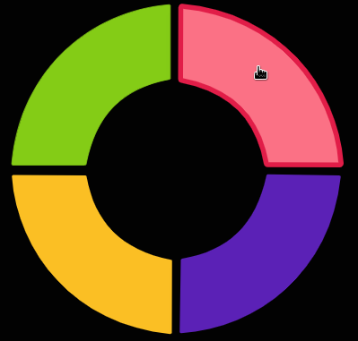

# Marco-Polo
## A fun web game to follow a  color sequence.
_AKA Simon Says_

  

## What you you spy on in this project 👁️‍🗨️️ 👁️‍🗨️️ 

_Don't know about you, but I enjoy seeing how others implement solutions ,so happy days_

- MobX
- TypeScript
- React
- A typescript Linked List implementation
- A typescript Queue Implementation
- Game Model
- Some Tailwindcss animations
- Count-down model
- React Router implementation

# Frameworks used
- ReactJS
- TypeScript
   - With classes, because  not all projects use functional programming
- Tailwindcss  - An awesome styling framework 
- MobX - A top level state store that uses JavaScript Proxy unlike any other
- SWC - Ejected App with a Rust web compiler bolted on - Speedy Web Compiler - Rust
- React Router